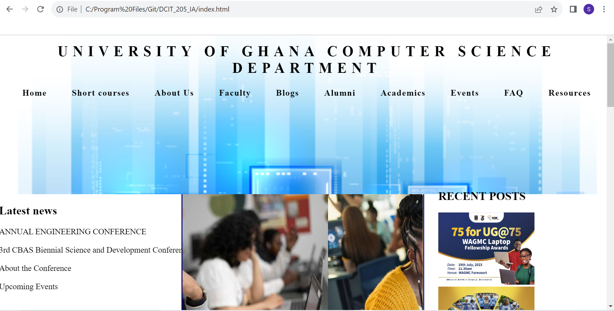
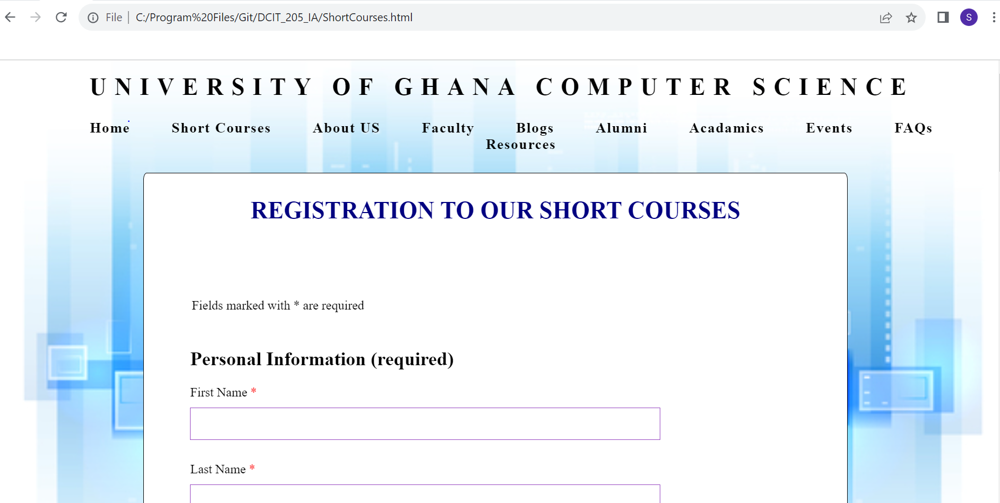
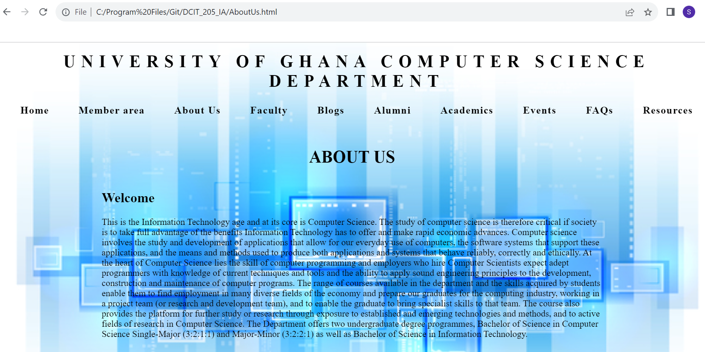
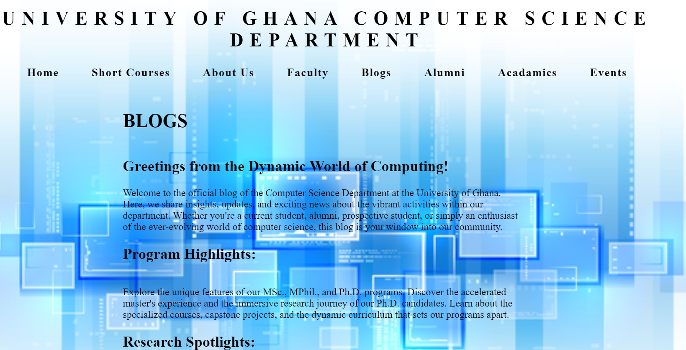
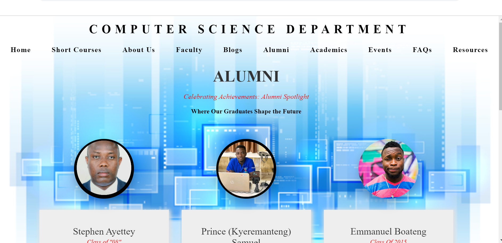
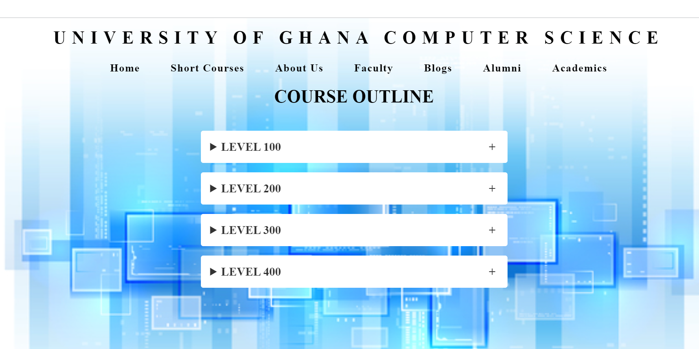
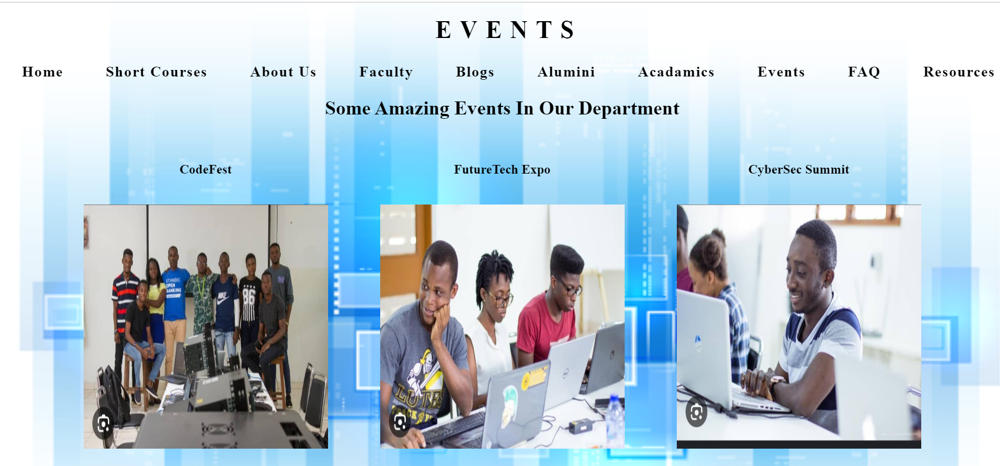
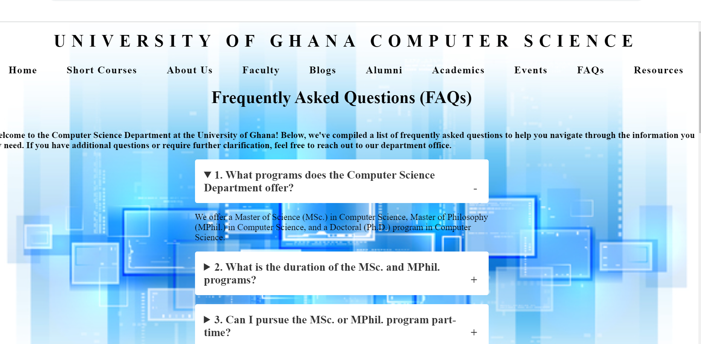

# DCIT_205_IA
# Computer Science Deparment

## Introduction and Purpose 

Welcome the Computer Science Department's Wesbite.
Check out cool projects, helpful stuff, and join our friendly group. Let's work on technology together.

# Purpose
Our website is a central hub designed to foster collaboration, showcase innovative projects, and provide valuable resources for students, faculty, and enthusiasts in the field of computer science. Whether you're exploring educational opportunities, seeking the latest research, or connecting with like-minded individuals, our platform serves as a dynamic space to support and amplify the impact of computer science in education and beyond.

# Project Set Up
Getting started with your project is quick and easy. Follow these simple steps:

Clone the Repository
Navigate to the Project Directory
Install Dependencies
Start Development Servers

# Screenshots

         

1. **Clone the repository:**
   ```bash
   git clone https://@github.com/SelssieSnowden/DCIT_205_IA.git

   ID:11120331


